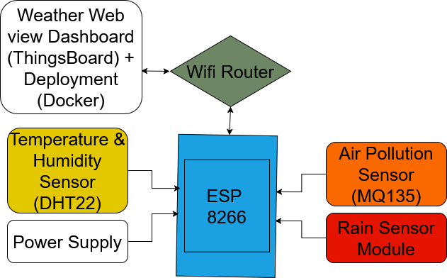
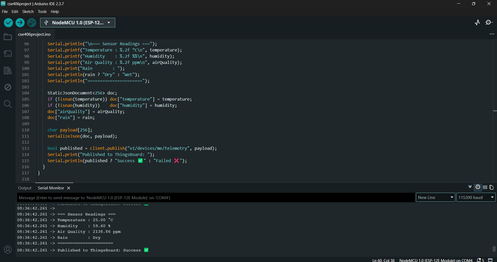
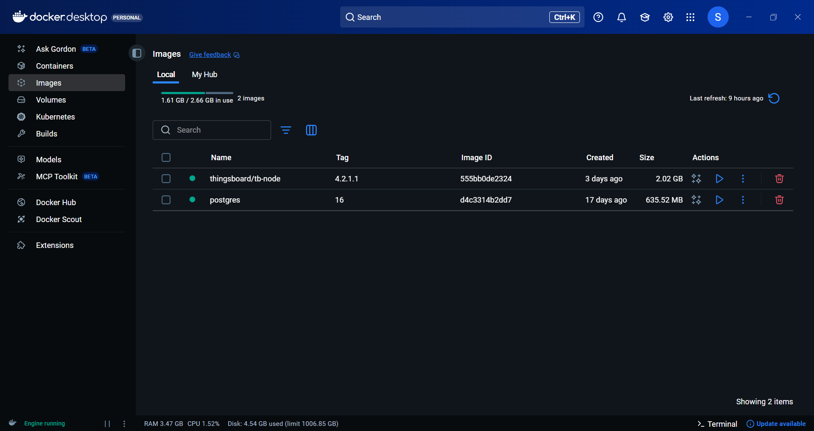
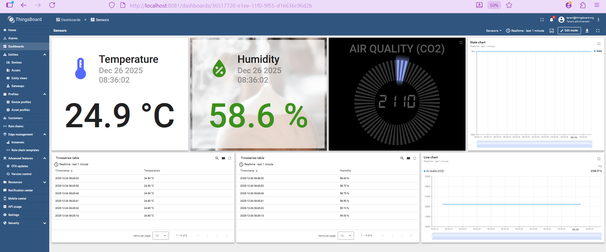

# IoT-Based Weather Monitoring Station Using ESP8266

## Authors
- Suddip Paul Arnab (Student ID: 2022-1-60-356)
- Ronjon Kar (Student ID: 2022-1-60-091)
- Sabera Zannat Sheba (Student ID: 2022-2-60-095)
- Tanjila Akter (Student ID: 2022-1-60-078)

Date: December 26, 2025

## Abstract
This project presents an IoT-based weather monitoring system using ESP8266 with DHT22, MQ135, and rain sensors. Data is transmitted via MQTT to a Docker-deployed ThingsBoard server for real-time visualization.

## Introduction
Weather monitoring is crucial for agriculture, transportation, and disaster management. This system uses IoT for low-cost, real-time data collection and visualization.

## System Architecture
- Sensing Layer: Sensors for temperature, humidity, air quality, rain.
- Communication Layer: ESP8266 transmits data over Wi-Fi using MQTT.
- Application Layer: ThingsBoard for storage and dashboards.



## Hardware Components
- ESP8266 NodeMCU: Main controller with Wi-Fi.
- DHT22: Temperature and humidity sensor.
- MQ135: Air quality sensor.
- Rain Sensor: Detects rain.
- Power Supply: 5V USB.

### Circuit Diagram and Pin Connections

| Component     | Component Pin | ESP8266 Pin   |
|---------------|---------------|---------------|
| DHT22 Sensor  | Data Pin     | GPIO2 (D4)   |
|               | VCC          | 3.3V         |
|               | GND          | GND          |
| MQ135 Sensor  | Analog Output| A0           |
|               | VCC          | 5V           |
|               | GND          | GND          |
| Rain Sensor   | Digital Output| GPIO14 (D5) |
|               | VCC          | 3.3V or 5V  |
|               | GND          | GND          |

## Hardware Setup


## Serial Monitor Output (Verification)



## Software Requirements
- Development: Arduino IDE.
- Backend: ThingsBoard CE, PostgreSQL, Docker.
- Libraries: ESP8266WiFi, PubSubClient, DHT, MQ135, ArduinoJson.

### Source Code
```cpp
#include <ESP8266WiFi.h>
#include <PubSubClient.h>
#include <DHT.h>
#include <MQ135.h>
#include <ArduinoJson.h>

/* ================= WIFI & THINGSBOARD ================= */
#define WIFI_SSID "Suddip"
#define WIFI_PASS "****"

#define TB_SERVER "192.168.0.100" // PC IP running ThingsBoard
#define TB_PORT 1883
#define DEVICE_TOKEN "xHC8Py0pufrZ1c0zrcmP"

/* ================= SENSOR PINS ================= */
#define DHT_PIN 2 // D4
#define DHT_TYPE DHT22
#define MQ135_PIN A0
#define RAIN_PIN 14 // D5

/* ================= OBJECTS ================= */
DHT dht(DHT_PIN, DHT_TYPE);
MQ135 mq135(MQ135_PIN);
WiFiClient espClient;
PubSubClient client(espClient);

/* ================= TIMING ================= */
unsigned long lastSend = 0;
const unsigned long sendInterval = 10000; // 10 seconds

/* ================= WIFI CONNECT ================= */
void setupWiFi() {
  Serial.print("Connecting to WiFi ");
  WiFi.mode(WIFI_STA);
  WiFi.begin(WIFI_SSID, WIFI_PASS);

  while (WiFi.status() != WL_CONNECTED) {
    delay(500);
    Serial.print(".");
  }

  WiFi.setSleepMode(WIFI_NONE_SLEEP); // IMPORTANT for MQTT stability
  Serial.println("\nWiFi connected");
  Serial.print("ESP8266 IP: ");
  Serial.println(WiFi.localIP());
}

/* ================= MQTT RECONNECT ================= */
void reconnect() {
  while (!client.connected()) {
    Serial.print("Connecting to ThingsBoard at ");
    Serial.println(TB_SERVER);

    String clientId = "ESP8266-" + String(ESP.getChipId());

    if (client.connect(clientId.c_str(), DEVICE_TOKEN, NULL)) {
      Serial.println(" Connected to ThingsBoard");
    } else {
      Serial.print(" Failed, rc=");
      Serial.println(client.state());
      delay(5000);
    }
  }
}

/* ================= SETUP ================= */
void setup() {
  Serial.begin(115200);
  delay(100);

  setupWiFi();

  client.setServer(TB_SERVER, TB_PORT);
  client.setKeepAlive(60); // MQTT keepalive

  dht.begin();
  pinMode(RAIN_PIN, INPUT);
}

/* ================= LOOP ================= */
void loop() {
  if (!client.connected()) {
    reconnect();
  }

  client.loop(); // REQUIRED for MQTT

  if (millis() - lastSend > sendInterval) {
    lastSend = millis();

    float temperature = dht.readTemperature();
    float humidity = dht.readHumidity();
    float airQuality = mq135.getPPM();
    int rain = digitalRead(RAIN_PIN);

    Serial.println("\n=== Sensor Readings ===");
    Serial.printf("Temperature : %.2f °C\n", temperature);
    Serial.printf("Humidity    : %.2f %%\n", humidity);
    Serial.printf("Air Quality : %.2f ppm\n", airQuality);
    Serial.print("Rain        : ");
    Serial.println(rain ? "Dry" : "Wet");
    Serial.println("======================");

    StaticJsonDocument<256> doc;
    if (!isnan(temperature)) doc["temperature"] = temperature;
    if (!isnan(humidity)) doc["humidity"] = humidity;
    doc["airQuality"] = airQuality;
    doc["rain"] = rain;

    char payload[256];
    serializeJson(doc, payload);

    bool published = client.publish("v1/devices/me/telemetry", payload);
    Serial.print("Published to ThingsBoard: ");
    Serial.println(published ? "Success " : "Failed ");
  }
}
```

## Docker Desktop – Images



## Docker Desktop – Volumes


## Docker Desktop – Containers


## ThingsBoard Integration
Real-time sensor data visualization using ThingsBoard dashboards.



## System Testing and Calibration

- Hardware inspection
- Power supply check
- Serial monitor verification
- Sensor response validation

## Results and Discussion
The system successfully displays real-time temperature, humidity, air quality, and rain status on the ThingsBoard dashboard.  
The Docker-based backend remained stable during continuous operation with low resource usage.

## Conclusion
A reliable, low-cost, and flexible IoT-based weather monitoring solution using ESP8266 and ThingsBoard.

## Demonstration Video


